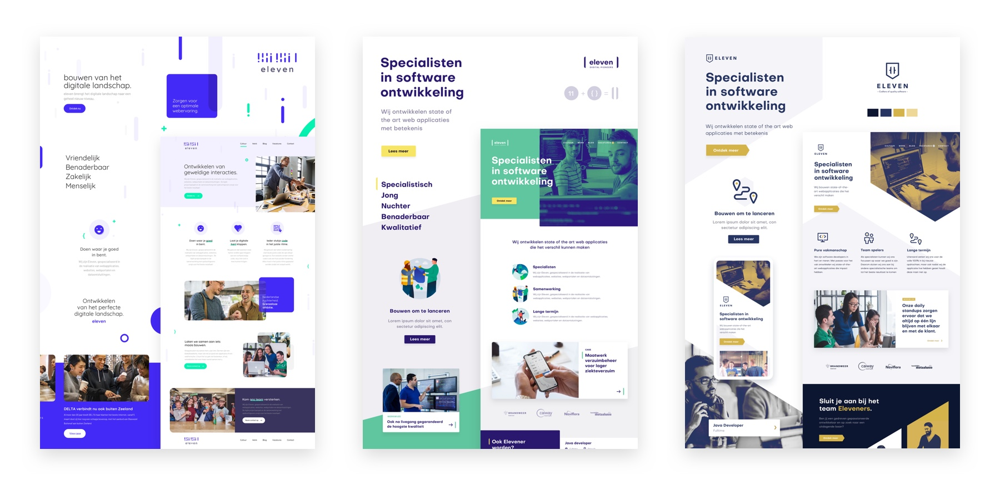
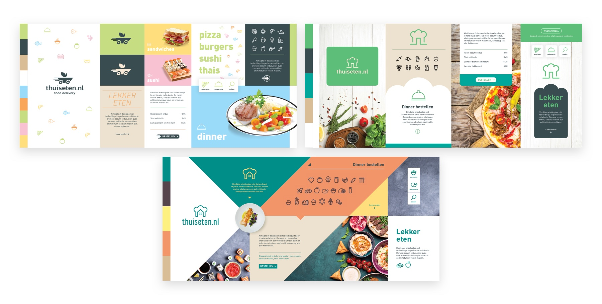

# Concept board

A concept board communicates both the visual identity concept and the world it lives in. It is designed to demonstrate the synergy of the visual language across different touch points, from macro to micro. The combination here is greater than the sum of its parts, providing an overall impression from which a client can make a decision.

It is the first deliverable a client gets to see after the Brand Identity Workshop. By default we propose three difference concept boards. All should capture a very different direction, while being able to refer back to the outcome of the workshop. A concept board isn't self-explanatory and should always be strengthened by a great rationale.

### Tips

* There is not one ideal layout for a concept board, but make sure that when you present three proposals that they all follow the same layout and content
* Try to add a page mockup where the visual identity is applied
* Avoid details like button states, font names, hex codes. They distract and are not important at this stage, where the only goal is to choose a direction

### Examples

### Links

[Other concept board examples](https://www.dropbox.com/sh/p629ove9f445gy5/AACJ77X1Uxd9vPYvGDnparcoa?dl=0)
