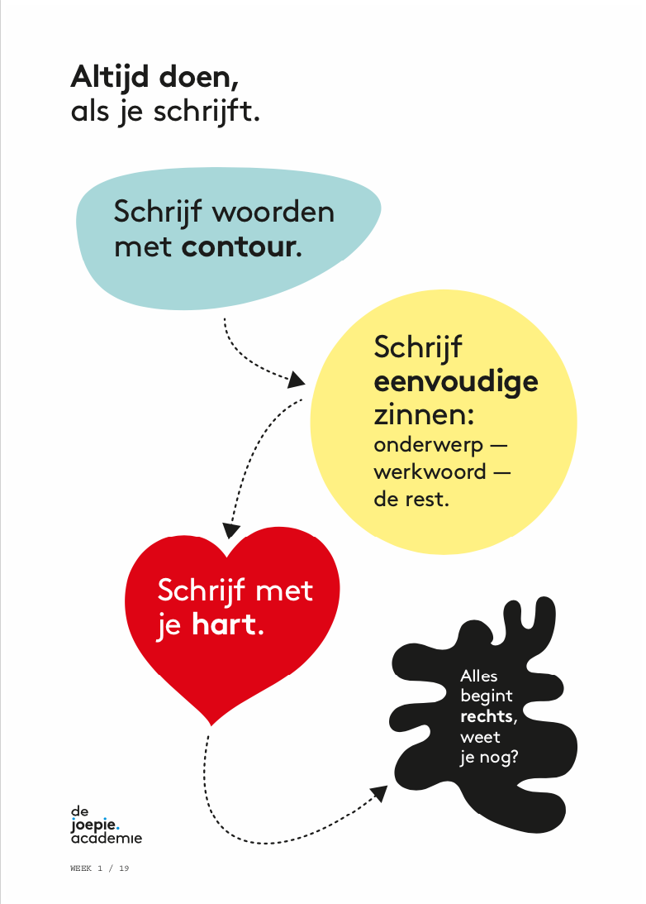

# Write Copy


This page is about writing copy for client work. If you are looking for a page where you learn about writing copy for Hike One, [Go here](https://hikeone.gitbook.io/company-playbook/getting-started/how-we-write)


The way a client talks to his visitors is every bit as important as his product, service or website. Copywriters can help companies to find their tone of voice and document it in a copy guide. This guide is the basis for all texts and a manual for anyone who writes and judges written text. In this guide, a client will find examples, guidelines, and an explanation for the way he talks online. Besides a copy guide, there are many more copy tools to offer to a client.

### Difficulty

Copy is not well known or even completely new or to many designers and clients. Often, they feel they will be able to figure it out themselves or they do not feel the need to add any changes to their existing copy. Make sure you mention it in the early stages of the process.

### Why you should advise copy

Many companies address their audience like any other company would do: there is no special tone of voice. Successful companies choose a different approach, which pays off. Their product or service is different to what is already out there and so is their tone, in commercials as well as online. Companies should always realise that their tone of voice must match their core values. Subtile changes in text can attribute to this. Especially when an organisation uses tools such as webcare and social media besides their website, different tones of voice can be found within the same platform. A copy guide will be of use, then.

### Need some help writing? Use this cheatsheet.&#x20;

### Continue reading:

&#x20;'**Jippie, ik schrijf een Joepie'.** You can find a copy of the book in every office. You can skim though tips book and find simple tips that directly help you tell your story. [Here is a sneak peak.](https://www.dejoepieacademie.nl/media/pages/50/attachments/jippie_ik_schrijf_een_joepie_eerste_27.pdf)

[Long copy](https://unitid.nl/make/long-copy/): Need to write a longer story, learn how to do it the Hike One way.\
[Microcopy](https://unitid.nl/make/microcopy/): Write great headers, subtitels and call to action labels.\
[Eindredactie](https://unitid.nl/make/eindredactie/): How it works, what you need, when to apply it.

### Who do you need?

1 or 2 copywriters, depending on the amount of text that needs to be(re)written.

### Related

[+Storytelling](https://paper.dropbox.com/doc/xnCa5PBAizjT96gHxOIjC)
