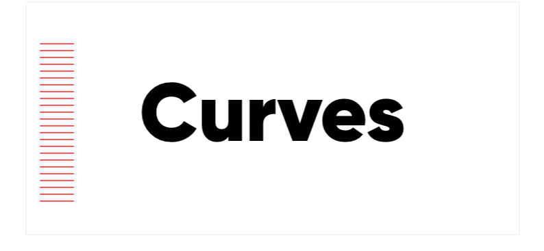
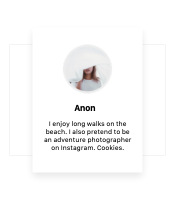
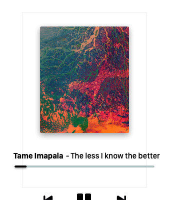
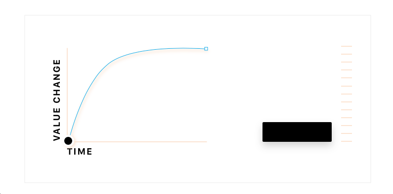

# Animation guidelines

Nothing in this guideline is a rule. It’s a guide to get you started if you have little to no knowledge about UI animations. A follow up on ‘Understanding animation’, with a more practical look at things. We will look at two main topics; Duration and Curve.

## Duration

You can categorise your durations, [**IBM’s carbon design language**](https://www.ibm.com/design/language/elements/motion#style) splits this into two styles:  ‘Productive’ and ‘Expressive’. And we'll just barrow those categories from them (its the only we borrowed, I promise). Productive being the fast and snappy and expressive the longer “cinematic” sibling. Productive ranging from 75ms to 200ms, 150ms being the default. Expressive can be plus 200ms and on, with 300ms being the default.

### **Usage**

Productive durations are mostly used for elements that tend to be more functional, simple it's transition, and frequently used. Like opening a simple navigation panel for example. Expressive durations are for more complex animations, larger value changes and require more user attention. Like the transition of a new screen or element on screen.

Durations are also relative to the amount of value change, if you use the same duration for a larger value change it won't convey the same feeling.&#x20;

### **Enter and exit**&#x20;

You want your enter animation to be on the expressive side, so the transition is witnessed and not sudden. Use a faster duration for the exit as it asks less attention from the user and also reduces the time the user needs to wait for the new screen.&#x20;

## Animation curves

A curve or so called easing makes an animation feel more natural. If you throw a ball it would carry a lot of speed at the beginning and start to slow down the more it travels. If you would drop that same ball from a building it would pick up more speed as it goes. This is how you can view animation curves, how objects behave in the real world. A Bezier-Curve dictates the rate of change of which an object changes. It can even have negative or positive values where it undershoots its starting state or overshoots its end state (you can see this in the example above). There are a bunch of articles online about animation curves but I found [**this article by** ](https://medium.com/motion-in-interaction/animation-principles-in-ui-design-understanding-easing-bea05243fe3)[**Suresh V. Selvaraj**](https://medium.com/@sureshvselvaraj?source=post_page-----bea05243fe3----------------------) a very good read. Animation curves (cubic-bezier) can consist out of parts which you can mix and match with the following ingredients: Fast, Slow and Constant Speed.

### When to use what curve?

The following example curves below and their usage are meant as a guide to help you understand what kind of speed an animation could possibly have. When dealing the following situations

* Enter animation of an object or screen
* Exit animation of an object or screen
* Object changing on screen&#x20;

\
**ease-in** \
(Starts slow and builds up speed) \
Can be used for an exit animation of an object or screen

\

**ease-out** (Starts fast and loses speed)\
Can be used for an enter animation of an object or screen&#x20;

\

\
**linear** (Constant speed) \
Used for time based animations like seeker on an audio player.

\
\
**ease** (Starts slow, accelerates, reduces speed)\
A curve that can really be used for anything, since it’s a smooth curve. Could be used for objects changing on screen.

The examples above are default curves (ease, ease-in, ease-out). When you want to pick a colour red, most likely you wouldn't pick the most saturated "default" red colour. The same goes for these curves mentioned above. Having said that, there's nothing wrong with them, there just the default choice. The other option is to use predefined curves in you arsenal like from [**easings.net**](https://easings.net/en)**.** Where someone else already went to the trouble to create a good set for you to use.\
\
On a final note don’t use too many different curves for your project as it might become hard to manage and you want to keep the same consistency and feeling across the entire UI.

###

###

### Types of curves

**1. Cubic bezier**

A Bezier curve is based on a mathematical equation, which in interface animations dictates the rate of change over time, the equation is also used  for vector paths for example to smoothen out curves and to manipulate them. Cubic Bezier is what you will use on the web, which is defined with 2 points for the beginning and end of the curve. See the demo’s below and play around with them to get a feel of it. If you really want to see what a curve does slow it down to a duration of 2 seconds. \
\
**Demo's:**\
[Easings.net](https://easings.net/en) (Collection of predefined curves) \
[Matthewlein.com/tools/ceaser](https://matthewlein.com/tools/ceaser) (Customisation and demo of curves)&#x20;

**2. Spring curve**

Spring curves are based on "physics" unlike a Bezier curve, which is why you dictate a Spring curve with properties like Tension and Friction. You can compare it to a ball dropping on the floor and bouncing a few time before it stops. What dictates this behaviour of the object is the mass, velocity etc. The short  answer to what is happening in a Spring curve is.. oscillation. And you can control the amount of ossolation.

There are a lot of Spring API’s out there, iOS and Android utilises their own. You will use this if you need to design for a native app or in some special cases for the web. [**Demo**](http://stakes.github.io/framerplayground/) that uses FramerJs, use the option 'Spring Rk4' (which one of the mathematical equations for a Spring curve).

Depending on what type of Spring API is being used you mostly cannot set a fixed duration. Bolow are the properties you can use to define a Spring curve. Think of a ball attached to an actual spring with these set of options you have. Not all Spring API's have all of these properties.

*

    1. **Tension** — Strength of the spring
    2. **Friction** — Weight of the spring
    3. **Velocity** — Velocity at the start (Optional)p
    4. **Tolerance** — Minimal threshold before the animation ends (Optional)&#x20;

## Wrapping it up

• Use expressive and productive durations to define your timings correctly\
• Durations are related to the amount of value change \
• Always make your exit animation faster then your enter animation\
• Use your curves related to the real world, define hem by deviding them into objects / screens entering and exiting, and objects changing on screen.\
• Don't use too many curves and durations as it might become to hard to manage.

## **Don't have a lot of time?**

The ultra simple way to go about this, is to use one curve for everything, this can help to speed things up. You can do the same for durations. 150ms & 300ms with an ease curve works best most of the time.&#x20;
