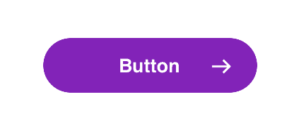
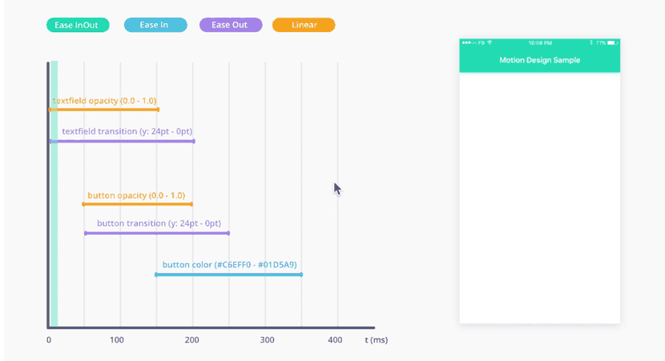

# Documentation

Just like any other design work, animations need to get handed over to development at some point. The most straight forward way is to hand over a video, but there is a big chance a lot of details will be missed. After all, it's the combination of property changes, timings, and easing curves that make the animation. If not implemented correctly, the animation will feel "off" and degrade the user experience instead of enhance it.

There are multiple methods to hand over your animation. We've highlighted a few.

## Method 1: Table with animation properties

This is the most common one. For this method you’ll need to reserve some time in your project, although when you get the hang of it you’ll discover it can be done quite fast. All properties of a single animation triggered by a single event (non-realtime interactions) are listed in a table view. It works best in combination with a video of the single animation. E.g. For a button with an arrow inside, where the arrow moves and where the button changes color **on hover,** you’d create a table for the hover event and all elements and its properties.

#### Event: Hover inside

| **Element** | **Property** | **Begin value** | **End value** | Delay | **Duration(sec)** | **Ease**               |
| ----------- | ------------ | --------------- | ------------- | ----- | ----------------- | ---------------------- |
| **Button**  | Shadow Y     | 0               | 4px           | -     | 0.3               | 0.25, 1.00, 0.25, 1.00 |
|             | Shadow Blur  | 0               | 20px          | -     | 0.3               | 0.25, 1.00, 0.25, 1.00 |
| **Arrow**   | X            | 0               | 10px          | -     | 0.3               | Spring (150, 15, 0)    |

90% of the time you can copy the values from your animation tool. But in the case of X and Y transitions, the position is relative to the component it’s placed inside of, which could differ from the way it’s built in code. For this reason, the default value is always 0.\
This method perfectly fits into the atomic design process. For instance, if you find yourself using the same ease a lot of the time, you can turn it into a reusable atomic and give it a label, such as “default curve”.

### **Pros**

* Specifications are very detailed and clear
* Almost no room for misinterpretation
* Forces designer to think about an animation-system
* Values can be copied as text
* Independent from animation and documentation tools

### **Cons**

* Less suitable for realtime interactions
* Requires you to invest some time

## Method 2: Component sheet combined with video export

Component based design is the practice of splitting certain UI elements into parts with clear names. This could be used for making your animations specifications. For example: element a will go to a second state when the item will be pressed. The second state will go back to the first state after 2 seconds.&#x20;

### **Master values**

Master values could be set in the early state of the project and documented in confluence or another file. You can give names to certain to certain objects, timeslots, HEX colors etc. In this example‘defaulttiming’ has been set as a master value in a file that overrules all the other components. When default timing changes from, let’s say 0.3 seconds to 0.2 seconds, this will affect all the components that have elements with the‘defaulttiming’ element in it.&#x20;

### **Pros**

* The component could be used for design documentation and animation documentation at the same time.
* The documentation is visualized.
* One overview of the whole steps.

### **Cons**

* It’s an image and values cannot be copied.
* If the animation has changed overtime, you’ll have to create a new component.
* Hard to get an overview of other animations in your project since every animation has its own component.

## Method 3: Visual Timeline

This one is probably the most time consuming to make, but at the same time offers a very clear and visual dissection of the animation. What you do is create a video of the animation your want to specify, but instead of adding a table underneath it, you make a visual timeline part of the video highlighting exactly which elements animate. It’s basically like making a screen recording of your After Effects or Principle time line.Unlike the table with animation properties, this method is very suitable for realtime interactions. Instead of showing a timeline, just show a scroll/drag line(muchlike Principle drivers).

### **What type of project**

This method is ideal for medium to large projects where animation plays an important role.

### **Pros**

* Specifications are very detailed and clear
* Almost no room for misinterpretation
* Forces designer to think about an animation-system
* Suitable for realtime interactions

### **Cons**

* Requires you to invest some time
* Values can’t be copied and pasted from the video

> Reference: [http://uxmisfit.com/2017/04/23/motion-design-specs-how-to-present-animations-and-interactions-to-developers/](http://uxmisfit.com/2017/04/23/motion-design-specs-how-to-present-animations-and-interactions-to-developers/)

## Other methods

### **Sit next to developer**

Working closely together with developers is always a good practice. Also physically siting in eachother vicinity makes it easy to collaborate, ask for advice and discuss various options early on. Anything you can agree to together without documentation saves you tons of time!

* Saves you the time of animating and speccing
* The implementation can be instantly reviewed and accepted
* You will still need to make mock-ups to illustrate an idea.

### **Code snippets (e.g. Framer)**

If you work in a tool like Framer, you can simply hand over the code.

* No need to write specs at all, as they have already been written
* Generated code snippets are often not be usable as production code. Though they can still help provide detailed instructions. Discuss with your developer upfront what is useful to them.

### Mockup video

Simply make a recording of your animation and give that to the developer to illustrate the desired end result.

* Using the scrubber of a video player allows the developer to view the animation in slowmotion
* A developer won't be able to extract exact properties or parameters from the video

### **Create animation yourself**

Why let let the developer do all the work when you can do some yourself? Some tools like Lottie allow you to export animations directly to code.

* You’re in full control of the animation
* It could save your developer a lot of time
* Only suitable for standalone animations like loaders and branded illustrations.
* Often the resulting code is not suitable for production - discuss with your developer what is useful to them.

### **Show a benchmark**

Why reinvent the wheel when there are already tons of awesome animations out there. Sometime it’s enough to simply refer to an existing animation. Suitable for projects with little budget and time.

* You don’t need to create the animation yourself.
* The result probably won't look exactly the same.
* The animation will not be unique.

## Ask a developer

It's important to include development in this process from the beginning, and not simply hand over your specs. The feasibility of animations heavily relies on technical frameworks and development capacity.

It's always useful to talk to a developer. They can give you insights on how it will be built and what is within the realm of possibilities to realise. It will save you a lot of time by checking this upfront and prevents disappointment later on.

