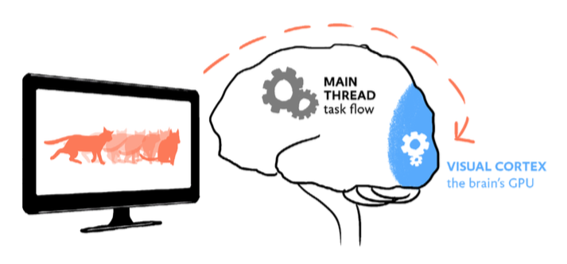

# Understanding UI animation

Animation is often seen as a form of delight, with that being its sole purpose. While delight is definitely a good reason to include animation, it is often quite difficult to sell this to your team. Mostly because the team needs to invest time in it, plus there is no clear added value for the user and business.

But actually there are many more reasons why including animation is a good idea and will ultimately lead to happier users and increased conversion.

## 1. Reduce cognitive load

Animation can reduce the user’s cognitive load, meaning it can reduce the amount of mental energy needed to perform certain tasks. It does this by adding critical context to seemingly disconnected elements and events.

This happens when objects move position on a page, or when the user moves from one scene to another. When no animation is applied, humans try to fill in the missing in-between frames themselves, encumbering the main CPU of the brain which should actually be used to perform tasks. When animation ís applied, the work is done by the visual cortex instead (the brain’s GPU), freeing up space in the rest the brain to stay on task.

## 2. Soften the pain of waiting

Animation is a perfect tool to mask slow performance, and even increase perceived performance. Everybody loves fast interfaces, but sometimes a system just needs a few seconds to load the next state.

It is possible to bridge this gap using a 'waiting animation' which main purpose is to show the user it’s still working (and possibly entertain while doing it). Another way is to gradually build up the next state of the interface before the heavy content is loaded.

## 3. Demonstrate

Animations can be used to demonstrate to a user how something works, by showing instead of telling. This can either be done through explanatory motion graphics or through moving content triggered by scrolling. These type of animations tend to be entertaining and delightful.

## 4. Give a sense of direct control

Users expect to have a sense of direct control when operating the interface in front of them, as if they were interacting with real-life objects. Animation can play an important role in in providing instant visual feedback when a user performs an action. Sound and haptic feedback can be used to strengthen this.

## 5. Guide the users eye

"The human eye is most sensitive to color and details in a very small spot called the foveal region. Meanwhile, our peripheral vision, while blurry and lacking color, is highly sensitive to movement. In fact, on the very outer edges of our retina, it doesn’t even transmit visual information to the brain. It only detects movement and sends a signal to jerk our eyes in that direction." Rachel Nabors- Animation at Work

That said, motion is a perfect way to guide users attention. When done correctly you are helping your user through the interface, potentially even leading to an increase in conversion. On the other hand, when not applied correctly, it can also distract users in performing a task.

## 6. Express the brand

Just like colour, shapes, typography, and photography, animation can be a vital part of expressing a brand identity. A brand has a certain personality and you can pick your easing curves and timings accordingly.

## 7. Make users smile

Animation can be very delightful to look at, and that is a perfectly fine argument to include it in your design. To a certain extent, all of the animations above, while serving a purpose, are also delightful to look at. The animations below are amazing to look at but the functionalities would have worked just as well without them. These are the types that are harder to sell, especially on a tight budget.

