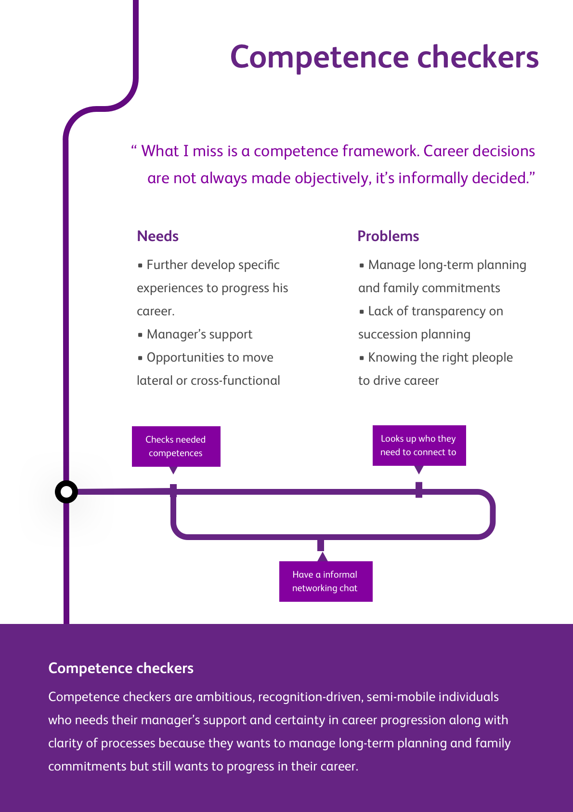

# Personas

Knowing your users is key to a successful product. Using all available data and user research we build personas to be used throughout the design process. Personas come in different shapes and sizes. We share them with the whole team, so we have a shared vision of our users. We use personas early on in the project, before we start designing.

## What: a representation of a user group

A persona is a representation of a user group, which helps to keep in mind their values, needs, behaviours and preferences while designing. It consists of elements to reference them by (i.e. a name and visualisation) and characteristics fitting with the persona’s goal. Common elements are values, needs, behaviour, pains & gains, preferred channels, used technologies, favourite brands, usage situations, and possibly some demographics. To create a more empathic reaction and more convincing persona, it helps to include quotes from participants.

Personas can be a one-off, meant for just one project, or an ever-evolving representation of all users/stakeholders for a client. They can be used for service, interaction and visual/brand design, which influences usefulness of the elements.&#x20;

They help to keep the user in mind, have an artefact to discuss and align your interpretation of the user’s needs, show knowledge gaps and provide a basis for decision making or designing from different perspectives.

## How to

1\. Determine what kind of persona you need, based on what purpose it serves. Also consider who will use the persona and how long. Base your research questions and the persona elements, format and medium on this. If possible try imagining proto-personas based on your assumptions to validate with the research in step 2.

2\. Start with gathering information about the user. Some clients already have data available on the current users and/or target group. Perform user research to complement it and to get the full picture you need: do interviews, field study, diary study etc.


When user research is not an option (no data or budget), we create personas based on desk research and our gut-feeling. These personas are still valuable because the exercise of producing personas restores the focus of an organisation back to the user.


3\. Cluster the insights from the research and try to find differences and similarities between the different kinds of people in your target group.

4\. Look for two major distinctive traits within the differences, which influence the kind of design decisions you will need to make later on. Such a distinction can be based on needs (e.g. guidance vs. freedom), behaviours (e.g. conservative vs. progressive), preferences (e.g. luxurious vs. minimal), etc.

5\. Try mapping all participants on the axes between those distinctive traits, to see whether they make sense: can you map a user on this axis? Is the axis filled on both sides? At the same time, try combining axes (e.g. one based on needs together with one based on behaviour) to see if they create useful quadrants.&#x20;


If there is an empty quadrant, that can mean several things.&#x20;

1. You might not have spoken to participants in that quadrant but they _do_ exist;&#x20;
2. nobody in your target group fits that quadrant;&#x20;
3. or the two axes actually map the same trait—e.g. someone who needs stability, a need, will also show conservative switching behaviour

Try to figure out which is the case based on your research, and act accordingly: switching the axes or trying to get data about the missing participants.



If the axes don’t help, you could base the personas on a different distinction, like customer type (e.g. consumer/business) or stakeholder roles (decision maker, primary user, administrator, etc.).&#x20;

Another possibility is to use different kind of frameworks, such as two axes meeting at their ends instead of the middle; adding a third axis to create a 3D framework; etc. However, do keep in mind a framework with four quadrants is probably the easiest concept to get across to your audience.


6\. Create personas based on the quadrants or hotspots of participants within the framework. Determine the kinds of traits you need to show for each persona (think back to step 1) and build each persona based on the data clusters from your research. If knowledge gaps emerge, this can be reason to do more user research.

### Tips

* A real-life user might not fit just one persona, but show the behaviour of _one_ in some part of your service, while acting like _another_ in a different part. This is fine, as long as you can make meaningful decisions based on the personas.
* Make sure the name is memorable. Try thinking of descriptive name based on the quadrant, like ‘Adventurous Artist’. This way, the name explains more of what the persona is like than just a name like ‘Paul’.
* The visual of the persona has to be on point, so if you look at the image you know who this is. You can use photos from a service like [This Person Does Not Exist](https://www.thispersondoesnotexist.com) or [Generated Photos](https://generated.photos). This helps in stimulating empathy, but might also show unimportant details (see the next tip). An illustration of a person (perhaps from [Open Peeps](https://openpeeps.com/)), or even something which doesn’t show bodily characteristics, but does show behaviour, might communicate more of the right things.
* Be careful with including demographics. Something like age, gender or ethnicity might make a persona ‘come to life’, but it might lead to the belief that no woman can be part of a male persona, while gender might have nothing to do with their behaviour.
* While personas help in making initial decisions by showing data in a useful format, they do not replace testing.

## Planning

To walk through the process, we advise to use at least 2,5 to 3 days, excluding finding the participants and the presentation. This way, you can prepare and test the interviews, execute the interviews and process the insights.&#x20;

### Interviews

To make sure a large amount of the diversity among your users shows up in your personas, you need to be able to speak to a diverse group of participants. We advise to interview at least 10 participants, but depending on the size of the user base, more might be necessary to cover more of this diversity.

### Roles

Creating personas is best done with at least two UX researchers. This way, the two researchers can rotate interviewing and note taking during the interviews, more of the possible insights are uncovered and a more refined framework can be developed. Adding another researcher makes this process even more pleasant and worthwhile, while more than three is probably not helpful.

It helps to involve the client in the definition of the research questions and as an on-looker during the interviews, to create more ownership and to ensure a better fit with the client’s needs for the personas.

## Examples

## Further reading

* [How to make personas scientific](https://measuringu.com/scientific-personas/) by MeasuringU about using statistics and making a typing tool
