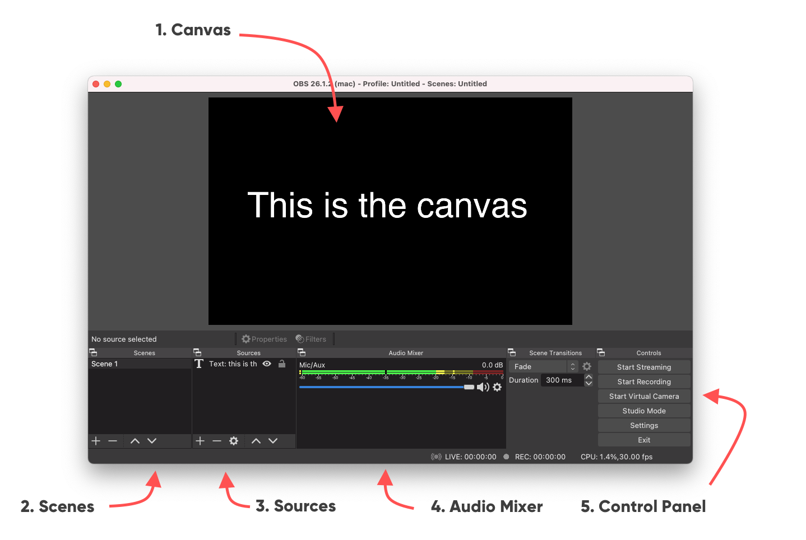

# How To Use OBS for Usability Testing

OBS (Open Broadcaster Software) is open source software that allows you to stream to almost any platform. Because of it's diversity, we can also use it to stream our uses tests to observers, stakeholders or just record it for later reference.

## 1. Installing OBS

1. Download OBS from their website: [https://obsproject.com](https://obsproject.com)
2. Open the DMG
3. Drag OBS to your applications folder
4. Open OBS, confirm and allow everything (it's not malware and needs access to your webcam, sound and screen so it can record those)
5. Cancel the setup wizard

## 2. OBS Overview

1. **Canvas** Think of this as your artboard. This will be what you will stream or record
2. **Scenes** each scene has it's own canvas. You can use this to create a "start" scene with an introduction, a "participant" scene with the user in fullscreen, a "usability test" with the user and the screen, a "break" scene etc.
3. **Sources** are similar to the layers in your favourite design tool. Here you add anything you want to see on your canvas: webcams, microphones, screencaptures, text, images etc.
4. **Audio Mixer** use this to keep an eye on the different audio levels
5. **Control panel** you'll only use this at the start and end of your stream when you hit "start streaming" or "start recording" and vice versa to stop it.

## 3. Technical Settings

OBS allows you to do many things, but that also forces you to set many options. So we'll do a crash course on those settings and explain which settings by default are suitable. \
\
The settings can be founds in the **Control panel** or by going to the _menu > OBS > preferences..._

### 3.1 Video settings

Set both your base canvas and output to 1920x1080. That's a high resolution with enough details, in an aspect ratio that fits most platforms (and TV's) without taking too much bandwidth. Having the output same as the canvas saves downscaling and is easier on your computer. \
\
25 frames per second are more then enough (again, prevents a big file) and is a european standard on framerate (PAL).&#x20;

.png>)

### 3.2 Output settings

Just like with your design tools, you can export your files in different formats. You can pretty much use the default settings.&#x20;

* **Bitrate** this is how much compression you'll use. The smaller the bitrate, the less information you'll store. User tests are quite static (not a lot of movement) so 1800 Kbps is more then enough for what we need.
* **Encoder** each frame needs to be compressed. If you have an option that says "hardware decoder" definitely use it as it will greatly reduce the load on your computer!
* **Recording path** this is where the recordings will be stored
* **Recording quality** We set this to "same as stream". This prevents your computer from having to compress two streams at the same time. Now it can just reuse the compression it uses for the stream
* **Recording format** MKV (Matroska) is a very efficient container for video and allows you a lot of flexibility. You can also set MP4 as the format as it is more popular.&#x20;

> Please note that MKV files can not be played by quicktime. You'll have to download VLC to play back.\
> However, OBS can also "Remux" MKV files to MP4. This only takes second. Don't convert MKV to MP4 in other ways as it will only lose quality.

.png>)

### 3.3 Stream Settings

If you are just recording, you can skip this. If you want to stream to a platform you'll have to let OBS know two things:

* To which server the stream needs to be sent
* Your secret stream key&#x20;

Luckily, OBS has presets for most of the biggest platforms so you can just set it to Youtube or Twitch.\
You do have to fill in a stream key. This is a secret key you receive when you set up a stream on a platform. For youtube it will appear when you schedule a stream. For Twitch you can find it in your dashboard.\
\
[Youtube - schedule a live stream](https://support.google.com/youtube/answer/2907883#zippy=%2Cschedule-a-live-stream)

## 4. Creating scenes

Now you can create scenes and set them up any way you like. We'll cover how to set up a starting/break screen and how to set up a scene that shows all the input for your usability test.

### 4.1 Starting/Break screen

* Click the plus sign in the **scenes** panel.
* Give it a good name (like "start")
* In **sources** click the plus sign
* From the popup menu select **image**
* Give this source element a name
* In the window hit **Browse** to find your image and add it
  * If you create an image with 1920x1080 dimensions, it will automatically fit
  * Otherwise, you can rescale and position the image in the **canvas**
* Hit **Ok**

In the same way you can add text to the scene, which allows you to update the message anytime you want.&#x20;

By double clicking a **Source** you can alter it.

.png>)

### 4.2 Usability Test screen

Now you can set up a scene in which you combine everything so the observers can follow along.

Plug in all your devices (webcames, microphones, capture cards). Most devices are plug and play, if not, make sure you've installed the proper drivers. Now you are ready to create your own fantastic scene!

* Click the plus sign in the **scenes** panel.
* Give the new scene a good name (like "usability test")
* In **sources** click the plus sign
* From the popup menu select **Video Capture Device**
* Give this source element a name (like "webcam")
* Go through the options in the **Device** menu and select the device you want to use
* Hit **Ok**
* Now you can rescale this source in the canvas and place it where you want

Repeat these steps to add:

* Webcams
* USB microphones (through **Audio Input capture**)
* Sound coming out of your macbook (through **Audio output capture\***)
* Images (like the Hike One logo!)
* Text (explain what people are looking at)
* Display captures (e.g. record your second screen that has the prototype)
* Capture cards (e.g. record HDMI inputs like a TV box)

> \*Audio output capture doesn't seem to be working well for macs. Loopback is quite intuitive and recommended for anything audio related. See [How to setup a usability test (local)](setup-an-usability-test.md#step-8-pass-through-audio-using-loopback). The digital output from loopback can be captured as and **Audio Input Capture**.

.png>)

### 4.3 Tips

Use layering to your advantage. In the example the webcam is placed behind all other layers and positioned so that we only see the user.

Another way to achieve this is by right clicking the **source** and from the menu select _transform > edit transform..._ where you can crop the image.

## 5. Operating the stream

Now you can start streaming! Just hit the button **Start streaming** in the **control panel**. Don't forget to also hit **Start Recording** in case you want to make a recording on your computer.

With twitch, it will instantly be available for people going to your twitch channel. For youtube, you'll have to check whether the stream arrives and then hit the **go live** button in the dashboard of the specific stream you've prepared.

To switch scenes, simply click them! Anything you see on your canvas can be seen on the stream. So we'll click the "start" scene at the start and when the first user is settled and has signed everything, hit the "usability Test" scene and the observers at home can join along.

## 6. Advanced options

### 6.1 Scene Collection

Perhaps you want to try something new or make some small changes to your scenes, but you want to make sure there's a back up in case it doesn't work.\
\
With **scene collections** you can name, delete, duplicate or make new scene collections. Go to _Menu > Scene Collection_ to do any one of these options. Here you can also switch between your scene collections you've already made.

### 6.2 Monitoring Sound

By default, you won't hear the audio that OBS will stream. If you do, you will hear everything from the microphones coming out of your speakers which is obviously not desirable when you're sitting in the same room as the participant. However, you might want to make sure the microphones are working. Or perhaps your computer is in another room.&#x20;

To monitor the sound that is coming into obs you can click the cogwheel next to the audio source in the **audio mixer** panel. By selecting the option **Advanced audio properties** at the bottom of the menu, you will see a new window. Here you can change the monitoring options per channel. When an option is selected to monitor, you will be able to hear it on your headphones or speakers.

### 6.3 OBS in video conferencing

When you're using a video conference tool (like Google Meet, Zoom, WebEx etc.) you can use the output from OBS in that conference call. In order to do this, first select **Start Virtual Camera** in the OBS **Controls** panel. Now there will be a "virtual webcam" that will throughput OBS's output.\
\
After you've started the virtual camera from OBS, open the conferening software. Inside the software, find the settings to change your webcam and select the OBS virtual camera. You might see a mirrored version (which is a personal setting in your conference tool), but the others on the call see a normal output.

### 6.4 **OBS plugins**

There are many plugins available for OBS to automate tasks and add functionality. But there are also some plugins that can help you to tweak some small settings.

**Capture computer sound**

For some reason, OBS doesn't seem to be able to simply capture the sound coming out of your macbook. To be able stream the sound from your mac, you'll have to use an app to convert your sound to a digital "audio input" so you can add it using the **audio input capture** in OBS' sources. \
\
You can either use Loopback, as explained in  [How to setup a usability test (local)](setup-an-usability-test.md#step-8-pass-through-audio-using-loopback)\
Another option would be to use [Virtual cable](https://vb-audio.com/Cable/) or [Audio Hijack](https://rogueamoeba.com/audiohijack/).

