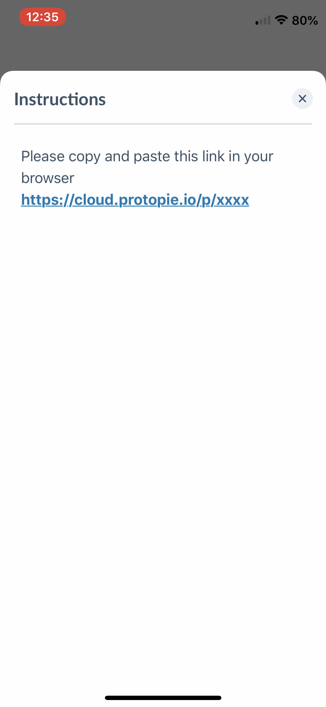

# Set up tools

## **Lookback**

**Our number 1 go to tool for (mobile) remote testing.**




👋🏻  See the setup steps in other tabs&#x20;



###

### 1. Add observers (clients) to the Hike One team

First login with our shared Lookback account you can find on 1Password. After that under you account in the top right hit members.

.png>)

Now it's time to add the mail addresses of the observers (from the client side) to our Hike One team. You can add them in the input field there. In order for them to join they will first need to create an account/free trial. Lookback works best on in Google Chrome.&#x20;

**Please delete clients from the team immediately after the usability testing day is over!!**&#x20;

.png>)

### 2. Create a new project

In the main dashboard of Lookback, hit the **New Project** button in the right top. Give your project a name and make sure it's set to **Private** and set the project to **Live share.**&#x20;

You can add the observers also from this screen by clicking the plus next to the private button. So only you and the clients can see this project and join the&#x20;

.png>)

### 3. Configure the Live Share

On this page you can configure what the user will see when they enter the test. You can set up an optional welcome message or some additional instructions.&#x20;

The most important part on this screen is actually the **landing page** option. Here you can insert the link of your prototype for example. If your prototype is not web based (ProtoPie) for example you can leave this field empty.

On the left sidebar in **Device requirements** you can set disable certain devices from accessing the test.

**When you're done hit the save button in the top right!**&#x20;

.png>)

### 4. Share the project with your users and observers

In your just created project hit the **Invite to remote** button to get access to the shareable links. The link above you can share with your users to access the test. The second one is for the observers.

If you're testing on mobile make sure your users have the [Participate app by Lookback](https://lookback.io/features/participate/) installed on their phone first and then open the link. It should open up in the Participate app. They should follow the on-screen instructions to give the app all permissions. On desktop the user will be prompted to install the **Participate browser extension. Lookback works best on Google Chrome.**&#x20;

.png>)

### 5. Starting the session

**Please note: Due to changes in the available plans we now pay per session. Our current plan has 100 sessions available, please avoid starting a session if not needed!**\
\
When the user has clicked the link and is in the test a button **Join Liveshare** should appear. Click that to start the test! Now if everything goes well you should be able to see the participant and their screen. You're ready to test!\

.png>)

### 6. Stopping the session

You can stop the current session by clicking **End Session** on the top right. The user is also able to do this from within the participate app. All captured sessions should appear individually in the project.&#x20;

### 7. How do I start another session with a different user?

You can just send the same link to all users. Every time they enter the session and you join as well this will be saved as an individual new session in your project.

### 8. My tests are over, what now?

When you've finished up testing **please be sure to delete the invited clients from our Hike One team** in Lookback. This is a very important step.



### 1. There are no steps!

Like explained in the setup, all sessions will be recording automatically. There is no need to start this by yourself.&#x20;

You can look back all the recorded sessions and share them with clients from within your project.\

.png>)



### How to communicate during the interview?

This is all built-in fortunately! Observers can just click your observer link and use the the chat window on the right.\

.png>)



Here are a couple of tips when using Lookback

#### 1. Make sure your users have the Participate app before testing

Mention this during the recruitment process, this saves time / trouble during the test day itself. You can use this [Email template](https://help.lookback.io/en/articles/911882-participant-email-template-remote-liveshare-desktop) to explain what to install. &#x20;

**2. When testing on mobile always allow for a test run with participants**

Allow for time on your project to do a tech check. During this check you can make sure the participant is able to use Lookback on their phone without any technical issues. It's recommended to do a test call via Lookback.

#### 3. Ask the phone number of your participant&#x20;

Make sure you have a phone number of the participants so you can call them if they don’t show up and guide them through the process of getting into Lookback.

#### 4.  When using a non web-based mobile prototype such as ProtoPie try using their player instead of Participates in app browser.

Most Prototyping tools have their own player. Make sure the user has these players installed on their device. It's best to share the link to the prototype in the instructions and make sure they copy and paste this on their mobile browser. Then the prototype should open in their respective player instead of Participates in-app browser&#x20;




## Zoom

**A great alternative, full equipped (mobile) remote testing tool**




**👋🏻** See the setup steps in other tabs



### 1. Schedule a meeting

The easiest way to do usability testing with Zoom is to schedule meeting for all individual participants. In the Zoom App you can easily tweak settings to make it easier to use during a usability test. \

| Topic:                       | Name of the participant                  |
| ---------------------------- | ---------------------------------------- |
| Date / Time                  | Moment of the test based on your roster  |
| Meeting ID                   | Generate Automatically                   |
| Video Host & Participant     | Off                                      |
| Calendar                     | Google Calendar (we use that @ Hike One) |
| Enable Waiting room          | True                                     |
| Enable join before host      | False                                    |
| Mute participants upon entry | True                                     |
| Automatically record meeting | True                                     |

.png>)

### 2. Save and share the meeting

After all above has been set, hit the **schedule** button. This will prompt you to create a Google Calendar meeting. Here you can either **copy the Zoom meeting link** and send this to the participant of invite them + the observers via a calendar invite. \
\
**Note the password and meeting ID as** **well**

### 3. Start the meeting and wait for the participant

The participant should join the meeting from desktop or their **phone if you are testing a mobile app prototype using the** [**Zoom mobile App.**](https://apps.apple.com/nl/app/zoom-cloud-meetings/id546505307)

### 4. Make sure the observers are muted and the right cams are on

By default anyone joining should be **muted automatically and their cams should be turned off.** This is to avoid pressure on the participant.

**Do the following:**

1. Turn your own camera on, unmute yourself
2. In the participants list click on the participant (not observers) and hit **"Ask to start video"** also make sure they are unmuted
3. **Make the participant the host.** This might sound weird but it's required in order for them to share their screen.

### 5. Make the participant share their screen.

As stated above make sure the participant is the host. They should do the following in order to share their screens:

**Mobile**

1. While being in the call hit the **share** button in the bottom
2. Then choose **screen**
3. Then hit **start broadcast**

**Desktop**

1. While being in the call hit the **share screen** button in the bottom
2. Choose **desktop** to share the whole screen

### 6. Send the link of the prototype to the participant

Send the link of the prototype to the participant so they can use it for the test. Make sure on mobile that they have the respective prototyping tool player installed beforehand.&#x20;

### 7. Ending the test

When the test is all done just ask the participant to end the call. Afterwards you can unmute the observers and use the current call to discuss the last test.



How do you record the Zoom meeting to look back the test?&#x20;

### 1. Hit the recording button

If set during the meeting schedule options the meeting should automatically be recorded. If not hit the record button on the bottom of the screen.

.png>)

### 2. When done, hit stop recording

Hit the same button again to stop the recording. When you end the meeting it will automatically save the recording locally to your computer and open up that folder.

.png>)



### What's the best way to communicate during the meeting?

Although Zoom has and built-in chat feature it' strongly advised to not use this! The participants will see these as well.

The best way is to discuss using an Whatsapp Group or Slack channel.



Here are a couple of tips when using Zoom for usability tests

#### 1. Make sure your users have the Zoom app before testing

Mention this during the recruitment process, this saves time / trouble during the test day itself.



## Skype for business

**The ‘highly secured company environment’ accessible tool**




**👋🏻** See the setup steps in other tabs



















