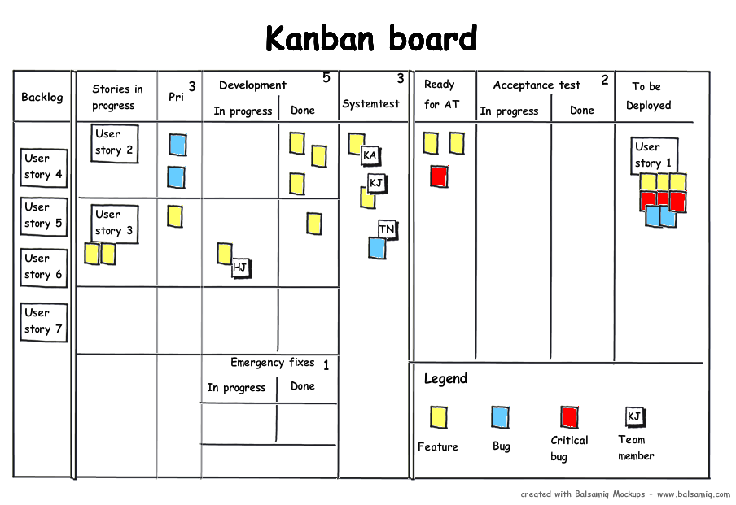

# Workflow and principles

## **Principles**

* Visualise Work in Progress (WIP)
* Limit the WIP
* Pull principle (working from right to left)
* Monitor, change and improve.

## **Kanban board**

**Vertical Lanes**\
A Kanban board is adjusted to the needs of visualisation which differs per project and should represent the workflow through which an item or ticket goes, however boards almost always contain; To do, Doing and Done vertical lanes. \
\
**Horizontal Lanes**\
Since not all items on a Kanban board have the same priority, Kanban encourages you make sure everything is visible this can be reached by introducing horizontal swimming lanes. For instance; If a super-duper-critial-blocking issue is noticed it should get the highest priority and be known by the team which often indicates that all the current work is put 'on-hold' to clear the issue and **pull** it through the workflow before the 'standard' work is resumed.

**Legend**\
Not all the work is the same and in order to indicate the differences it might be beneficial to color code the tickets. Make sure that the distinction is visible on the board so that the difference in tickets is clear for everybody.

**Estimation**\
For the team to have an indication concerning the work, work should be estimated.

**Dependancies / Team members**\
If certain topics require specific skills it should be indicated on the ticket including the amount of work it will be per discipline.&#x20;

**Throughput / Cycle Time**\
Also known as lead time, which indicates how much time a certain items has taken to go through the whole workflow. \
\
**Limit WIP**\
Kanban dictates that since an individual can only focus on X amount of work and studies even showed that the more items in the to do per person the less effective this person is. Therefore Kanban encourages you to set a limit to the items in a certain lane. One major result of the limit it that very soon bottlenecks are starting to show.&#x20;

\
