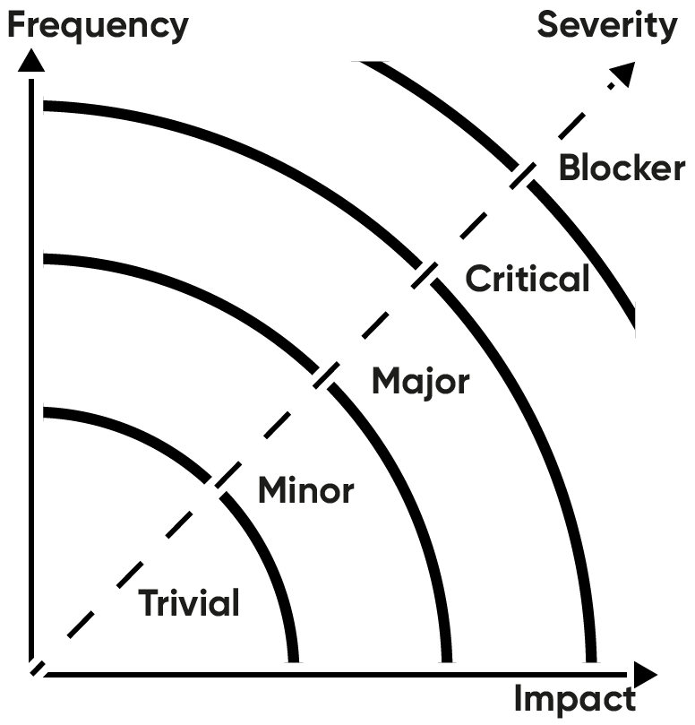

# Bug reports

The aim of writing bug reports is enabling someone to resolve a problem and thereby improve the product. At the same time, a bug report should indicate relevance and severity so the Product Owner can determine the priority of fixing a bug. These guidelines explain how to write consistent, clear and effective bug reports.

## Before you report

Make sure...

* ...you have the correct/latest version of the product.
* ...the issue occurs within the product.
* ...the issue is in the defined scope (supported browsers, devices etc).
* ...the bug should be reported to _this_ team.
* ...it's a bug and not a feature request.
* ...the bug isn't already reported (by someone else).
* ...to report each issue separately.

## Report contents

A bug report should always contain:

* Report summary
* Report details
* Severity
* Priority

## Report summary

Both the Product Owner and developers should be able to quickly see what a bug is about and understand the importance to fix it. It's therefore important to **write a clear and concise report summary**. A summary should uniquely identify a bug, explain the problem that occurs and, possibly, the context.\
Example of how and how notto write a report summary

* Poor summary: “App crashes when navigating”
* Good summary: “App doesn't load form when selecting change profile in IE8&9”

A summary does not need to contain the expected result or behavior, nor a suggestion for a solution. While this information is relevant, it should be described in the report details.

## Report details

The report details should contain all the information needed to reproduce and resolve the issue. This requires a detailed description, which steps were taken, what was expected and in what environment the problem occured. Make sure to include the following in your report details:

* Problem description
* Reproduction path
* Environment variables

### Problem description

Elaborate on the report summary. Be precise, specific and verbose. The description should contain:

* **Symptoms** - Describe the symptoms and diagnose if possible. How did you notice the problem? How does the problem manifest/what was the (unintended) result? What consequences does it have?
* **Expectation** - What did you try to accomplish and what would be the expected result?
* **Occurrence** - Does the problem always occur or only under certain circumstances? Is the problem a regressive issue (is it a new issue dat didn't occur in the previous version)?

To clarify the symptoms and occurrence add the following when relevant:

* **URL** - Location(s) where the problem occurred.
* **Screenshots** - Capture the symptoms and annotate when possible.
* **Error stack** - Add log file or console error dump if you can.


A solution may be proposed, but is not required in a bug report.


### Reproduction path

Provide a **step-by-step description of what actions to perform** to reproduce the problem. Someone else should be able to reproduce the problem based on these steps without any help. Preferably, write it as a numbered list (1. select..., 2. click...). If you didn't trigger the problem, what event did?

### Environment variables

Under which conditions did the problem occur?

* **Project version** - Version number or tag name (e.g. v1.2.12)
* **Date & time** - Note as exactly as possible, so appropriate logs can be looked up.
* **Operating System** - Vendor & version (e.g. Windows 11 21H2, macOS 12.2, Ubuntu 20.04)
* **Browser** - Vendor & version (e.g. Chrome 99)
* **Plugins and settings** - Any specific plugins, scripts or settings that might cause the problem?
* **Internet connection** - Does the problem error occur when in offline mode or always?

### Related issues

Is the problem related to another issue? A problem relates to a story when that story no longer passes its acceptance criteria (see [User stories](user-stories.md)). When it does, you should reference it. If you expect the problem is caused by another issue you should also link to it. You link to another issue by referencing its unique issue identifier.

## Severity

For a Product Owner, it is important to know how severe a bug is. How frequently does the problem occur? And if the problem occurs, how big is the impact? If a problem occurs rarely and the effect is minimal, the problem can be considered trivial. When a problem occurs often and has a huge impact on the usage, it's considered a blocking issue. All levels in between may be harder to define. The following scale and diagram should help to determine the severity level.

Severity level from highest to lowest:

* Blocker
* Critical
* Major
* Minor
* Trivial

## Priority

Based on the description, relevance and severity the Product Owner should now be able to define the priority of fixing the bug.

## Workflow & Tools

Now you know how to report a bug, this is what you should do when you identify a problem:

* Stop what you are doing and don't change anything.
* Capture the problem (url, screenshot, error stack).
* Write down first symptoms and expected result.
* Try to reproduce (new tab or session, but keep the original open).
* Write down the reproduction path and occurrence.
* Try to diagnose and isolate the problem.
* Complete report description and note environment variables.

### JIRA Capture

When using JIRA for issue management you can (and should) use [JIRA Capture](https://www.atlassian.com/software/jira/capture) to quickly generate complete bug reports using a browser plugin. The JIRA Capture plugin allows you to directly add a bug to a JIRA project. The plugin creates a screenshot which you can annotate, and automatically adds most environmental variables. You can directly set severity and assign the issue. You can even create custom [report templates](https://confluence.atlassian.com/display/CAPTURE/Templates+and+Variables) to assure bugs are reported completely and consistently.

## Resources

* [MDN Bug writing guidelines](https://developer.mozilla.org/en-US/docs/Mozilla/QA/Bug_writing_guidelines)
* [How to report bugs effectively](http://www.chiark.greenend.org.uk/~sgtatham/bugs.html)
* [How to write a good bug report? Tips and Tricks](http://www.softwaretestinghelp.com/how-to-write-good-bug-report/)
