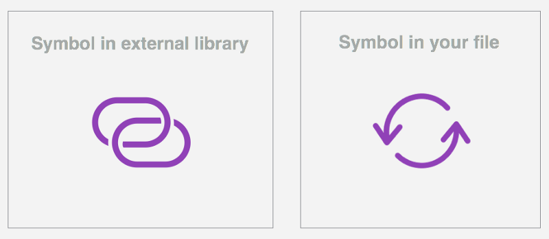

# Libraries

The Libraries feature is available since October 2017. Version 47 is when magic began! Many design teams of any size, small and big, introduced **Libraries** in their design routine, as did we! \
Why?

1. It speeds up our design process
2. It creates a “single source of truth”
3. It allows us to share Symbols between documents, and other designers.

## How to

Sketch has an official guide on how to set up libraries on their latest version of Sketch.&#x20;



## Best practices

### Set a Library wishlist

Together with your team, decide on the list of initial building blocks you want to include in your Sketch library. Depending on the type of project, following Atomic Design rules could be a good option. As [Brad Frost](http://bradfrost.com/blog/post/atomic-web-design/) explains, the general idea is you’d want to create the smallest elements (atoms) first, then how you’d use these elements within something bigger (molecules). And how these would be combined to form a larger group (organisms), and so on (templates).&#x20;

### Naming convention

* Follow a control/definingproperty-state naming convention.
* Always use lower case separated by dashes.
* Your names shouldn’t be too tied to a controls physical attributes, since they’re likely to evolve.
* Sketch automatically organises Symbols into folders when you put a / in the name, so use it to nest similar symbols in overarching folder.
* If possible get the lead developers already involved at this stage. Agree on some rules you can both follow and try to come up with a common language. This will ease the communication in later stages

#### Examples

* buttons/primary-mouseover            &#x20;
* button/primary

### Layer names and hierarchy

**Layer names**\
Make sure the layers, and especially the nested symbols in your symbol are named in a recognisable and consistent way. Decide on a naming convention and stick to it. Text layers e.g. are always be“label”,background are always“bg”

\
**Layer hierarchy**\
Your layer hierarchy is reflected in the overrides panel. You can help future users by making sure the layer order for your symbol reflects the visual order of the symbol.

## Frequently asked questions

**Is it possible to run multiple libraries in the same Sketch document?** \
You can run as many libraries as you’d like in the same Sketch document. \

**What’s the difference between symbols and library symbols?**\
Symbols allow you to reuse elements easily across your document’s Artboards, Pages and multiple documents. All changes will only affect that Sketch document where those Symbols are saved (locally). Library symbols work globally instead. They’re connected to the Library and every change will cascade in all Sketch documents where the Library is in use.

\
**Since a library is just a simple Sketch file, how do I recognise it?** \
If the file you’re working on is a library, you’ll see a message at the bottom of the Sketch window.&#x20;

**Won’t I lose all of the symbol overrides for button symbol?**\
Nope! Sketch treats external symbols just like local symbols, so any overrides that are available in your master file will be available in your local file as well. That means if your master file has five different colour symbols that can be used to swap the colour of a button symbol, those same five colours will be available in your local file.&#x20;

**Does it work with text styles and layer styles?**\
Not yet, but it’s in Sketch’s roadmap. There’s a work around though that works very well and it’s explained in[ Sketch docs](https://www.sketchapp.com/docs/text/text-styles/).

**If I add symbols to a library, will users of that library have to update their file(s)?**\
Nope! If you add new symbols, these will just show up in the “Add Symbol from Library” dropdown.&#x20;

**I don’t want \[name] to mess with the parent library. Is there a way to manage user permissions?**\
Natively, not right now. You can accomplish this through Dropbox, Google Drive folder and [Sketch Cloud](https://www.sketchapp.com/docs/sketch-cloud/). Or you can try some version control tools like [Abstract](https://medium.com/@goabstract), [Kactus](https://kactus.io/), or [Folio for Mac](https://medium.com/@FolioForMac). &#x20;

**Can I reference a Library in a Library?**\
Yep. Libraries can reference other libraries. Updates will cascade through each one though, so you’ll have to sync them all individually (don’t forget). And remember, if you change the Artboard size of a nested symbol, the re-syncing won’t update the size but it will stretch its contents. You have to always update the symbol by right clicking on it and selecting “Set to original size”.

## Learn more

* [Sketch libraries documentation](https://www.sketchapp.com/docs/libraries/)
* [Sketch symbols documentation](https://www.sketchapp.com/docs/symbols/)
* [Sketch symbols best practices](https://medium.com/@lloyd/sketch-symbols-best-practices-now-that-nested-overrides-are-a-thing-9b651d3fe1a4)
* [Hike.one library example](https://www.dropbox.com/s/uciil9pyesudm39/library_hike-one.sketch?dl=1)
* [Mastering Sketch Libraries](https://medium.com/ux-playbook/best-practices-plugins-and-tips-to-master-sketch-libraries-8f325bd3ea7f)

